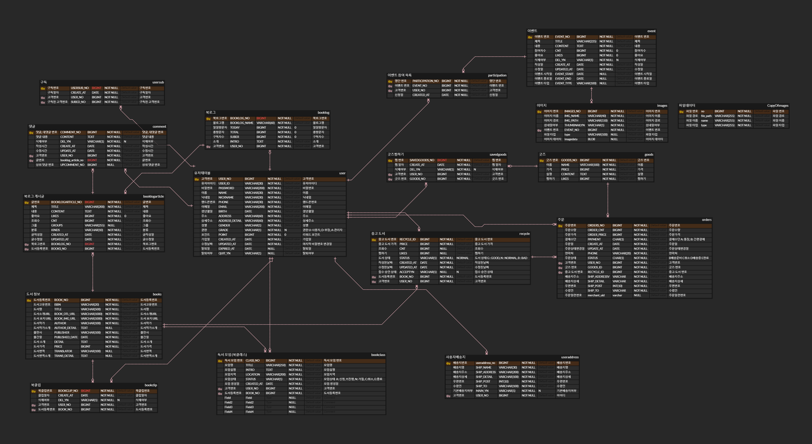

# Biscuit - 도서 블로그 네트워크 웹 서비스

## 목차
* [프로젝트 개요](https://github.com/chickencoc/Biscuit_teamProject-Public#프로젝트-개요)
* [기술 스택](https://github.com/chickencoc/Biscuit_teamProject-Public#기술-스택)
* [프로젝트 구성](https://github.com/chickencoc/Biscuit_teamProject-Public#프로젝트-구성)
  * [아키텍처](https://github.com/chickencoc/Biscuit_teamProject-Public#아키텍처)
  * [ERD](https://github.com/chickencoc/Biscuit_teamProject-Public#ERD)
  * [API 목록](https://github.com/chickencoc/Biscuit_teamProject-Public#API-목록)
* [서비스 기능](https://github.com/chickencoc/Biscuit_teamProject-Public#서비스-기능)

## 프로젝트 개요

* 프로젝트 소개

  > 비스킷은 누구나 간편하게 사용할 수 있는 도서 블로그 네트워크 서비스 웹 사이트입니다. 
  > 단순히 책이나 글 등을 읽는 행위를 넘어 감상과 생각을 기록하고 공유하며
  > 풀리지 않았던 의문들을 독자끼리 함께 대화로 풀어내는 소통하는 광장을 만들고자 했습니다.

* 프로젝트 기간
  * 2023.08.01 ~ 2023.08.31

* 프로젝트 시연 정보
  * [배포 사이트 Link](http://ec2-3-39-189-163.ap-northeast-2.compute.amazonaws.com/biscuit-project)
  * [데모 비디오 Link](https://youtu.be/MqECvmNpCtI)
  * [프로젝트 PPT Link](https://github.com/anjxxyi/Biscuit_teamProject-Public/blob/develop/process/file/Biscuit_final-project_PPT.pdf)

* 프로젝트 참여 인원
  

    |안재이(팀장)|김성은|박종빈|권은지|최현정|
    |:---:|:---:|:---:|:---:|:---:|
    |[anjxxyi](https://github.com/anjxxyi)|[chickencoc](https://github.com/chickencoc)|[Jonville](https://github.com/Jonville)|[xxnjx](https://github.com/xxnjx)|[hyungeongchoi2](https://github.com/hyungeongchoi2)|
  

## 기술 스택

* 백엔드  
       
     
  
* 프론트엔드  
     
  
* 배포  
  
  
* 협업 툴  
  
  
* UI  
    

## 프로젝트 구성

### 아키텍처

### ERD

### AWS 인스턴스

### API 목록
* Book
  |Function|Method|End Point|
  |:---|:---|:---|
  |도서 검색|POST|/api/books/list|
  |도서 상세|POST|/api/books/info|
  |도서 찜 등록|POST|/api/books/clip|
  |도서 찜 삭제|PUT|/api/books/delclip|
* BookClass
  |Function|Method|End Point|
  |:---|:---|:---|
  |북클래스 개설|POST|/api/books/apply|
  |북클래스 전체 목록|GET|/api/bookclass/list/{userNo}|
  |북클래스 상세|GET|/api/bookclass/classNo={id}&userNo={no}|
  |북클래스 수정용 정보 조회|GET|/api/bookclass/{id}/e|
  |북클래스 수정|PUT|/api/bookclass/{id}/update|
  |북클래스 검색|GET|/api/bookclass/search/q={keyword}&u={userNo}|
  |북클래스 참여|POST|/api/bookclass/party/in|
  |북클래스 참여 취소|POST|/api/bookclass/party/out|
* Order
  |Function|Method|End Point|
  |:---|:---|:---|
  |상품 주문|POST|/api/orders/add|
  |주문 취소|GET|/api/orders/cancel/{no}|
  |주문 상태 변경|POST|/api/orders/change|
* User
  |Function|Method|End Point|
  |:---|:---|:---|
  |도서 찜 목록 보기|POST|/api/member/clip|
  |북클래스 개설 목록 조회|POST|/api/member/class/open|
  |북클래스 참여 목록 조회|POST|/api/member/class/party|
  |사용자의 주문 내역 보기|GET|/api/orders/list/{no}|
  |사용자의 상태별 주문 내역 보기|POST|/api/orders/sort|
* Admin
  |Function|Method|End Point|
  |:---|:---|:---|
  |회원 목록 가져오기|GET|/api/admin/list/{type}|
  |회원 권한 수정|GET|/api/admin/authority/{userNo}|
  |회원 탈퇴 처리 및 복구|GET|/api/admin/out/{userNo}|
  |북클래스 삭제|GET|/api/bookclass/delete/{no}|
  |북클래스 목록 보기|GET|/api/bookclass/all/{sortNum}|
  |북클래스 상태 변경|GET|/api/bookclass/status/list={numList}&status={status}|
  |모든 주문 내역 보기|GET|/api/orders/all|

## 서비스 기능

### books
   Python 스크랩핑을 이용해 책 정보 저장   
   bookclip 기능을 이용해 mypage 에서 저장한 책 정보 확인 및 삭제
### booklog
   CRUD 구현   
   서로의 booklog 구독 및 취소 기능    
   글과 booklog search 기능 
### bookclass
   bookclass 참여 및 참여취소 기능   
   bookclass 개설 기능   
   admin : 개설한 bookclass 관리기능 
### Us, Earth
   중고도서 구매   
   중고도서 신청   
   admin : 신청한 중고도서 승인 
### goods
   goods 구매   
   admin : goods 등록 및 수정 및 상태 변경 
### event
   참여 및 취소   
   admin : event 등록 및 참여자 리스트 엑셀 파일다운로드 
### 회원
   회원가입, 로그인, 아이디, 비밀번호 찾기, 정보수정, 탈퇴   
   mypage bookclip, bookclass 현황, 주문내역 확인   
   admin : user 관리(탈퇴 및 복구, 권한)  
